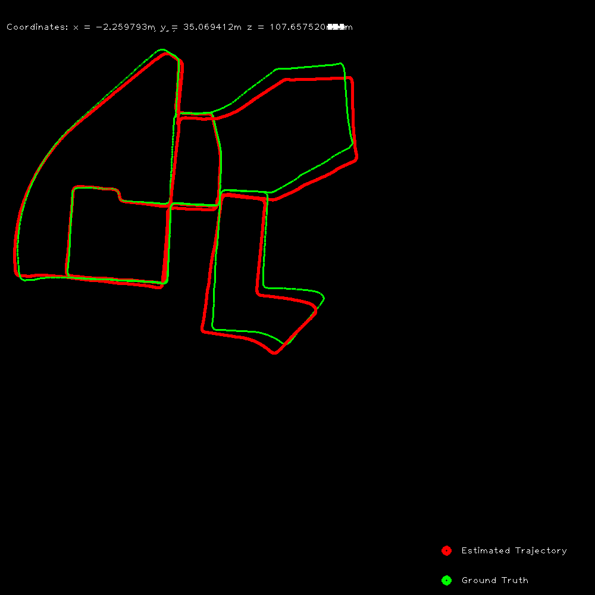

# visual_odometry

This is a monocular visual odometry implementation using OpenCV and c++. Steps involved in the implementation are:
1. Feature detection using FAST
2. Feature tracking using Lucas-Kanade Optical Flow
3. Compute Essential Matrix using RANSAC and recover pose
4. Estimate absolute scale using GPS data.

The scale information is obtained from GPS data. The GPS data is in the form of latitude, longitude and altitude. The GPS data is converted to UTM coordinates and the distance between two consecutive UTM coordinates is calculated. This distance is used to estimate the scale factor.

## Dataset
The code is tested on the KITTI dataset. The dataset can be downloaded from [here](http://www.cvlibs.net/datasets/kitti/eval_odometry.php). The code is tested on the sequence 00. The ground truth data is provided in the dataset. The estimated trajectory is compared with the ground truth data to evaluate the performance of the algorithm.

## How to run the code
1. Clone the repository
2. Download the KITTI dataset
3. Run the following commands:
```
mkdir build
cd build
cmake ..
make
./vo
```
Make sure to change the path of the dataset, gps data and ground truth data in the comfig.yaml file.

## Results
The estimated trajectory is shown below. The red line represents the ground truth trajectory and the blue line represents the estimated trajectory.



Demo video is shown below:

[](results/vo.gif)

## acknowledgements
The code is inspired from the following sources:
1. [Monocular Visual Odometry using OpenCV](https://avisingh599.github.io/vision/monocular-vo/)
2. The UTM conversion code is taken from [here](http://www.gpsy.com/gpsinfo/geotoutm/gantz/)
